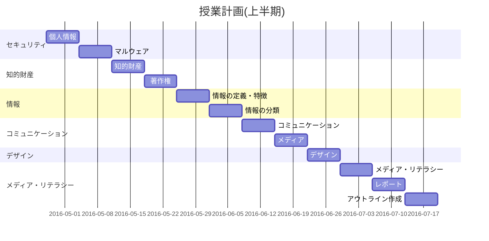
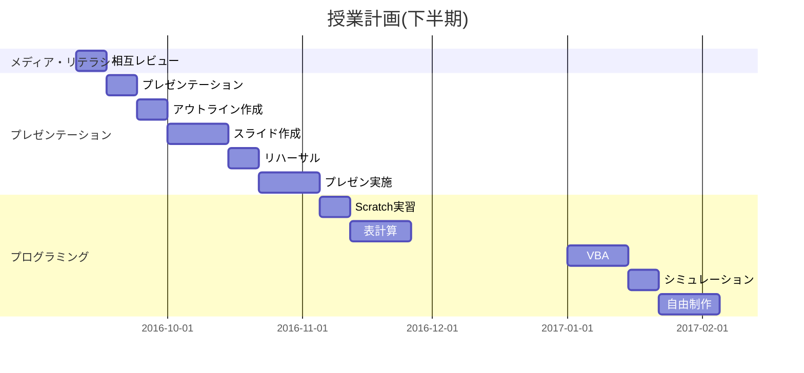
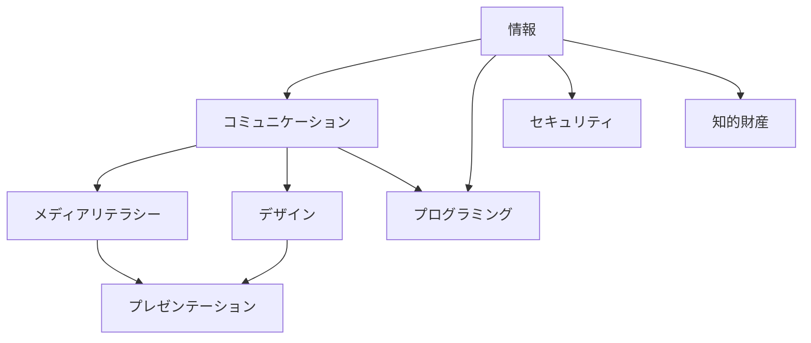

# 年間計画
教科書: [実教出版『高校 社会と情報』](https://amazon.jp/dp/4407202262)

<!-- workaround for bug of cutemarked -->

## 上半期
- 4月: [セキュリティ](security/README.md) (個人情報、マルウェア)
- 5月上旬: [知的財産](intellectualproperty/README.md) (著作権)
- 5月中旬: [情報とは](information/README.md) (情報の定義・特徴、情報の分類)
- 6月上旬-中旬: [コミュニケーション](communication/README.md) (コミュニケーション、メディア)
- 6月下旬: [デザイン](design/README.md)
- 7月-11月上旬: [メディア・リテラシー](medialiteracy/README.md) (レポート、プレゼンテーション)

## 下半期
- 7月-11月上旬: [メディア・リテラシー](medialiteracy/README.md) (レポート、プレゼンテーション)
- 12月-2月: [プログラミング](programming/README.md) (Scratch、Excel、VBA、Scratch)

## 単元の関連性・位置づけ

