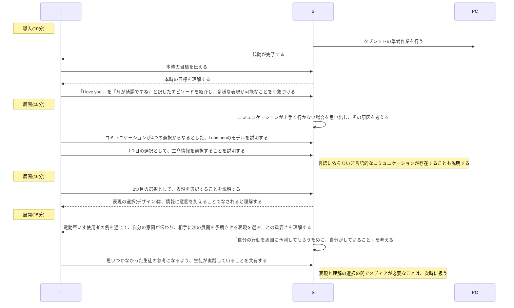
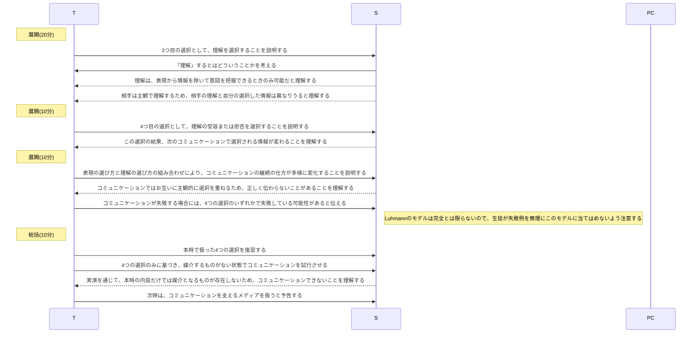

# コミュニケーション(2時間)
単元: 社会と情報「コミュニケーション 1.コミュニケーション」(p.28-29)

## 本時の位置づけ
コミュニケーションは人間生活の中心を占めると同時に、社会の構成と維持に不可欠な行為であり、「社会と情報」で扱うべき中心的な概念である。
社会のグローバル化や機能的分化が進んだことで、多様で異質な他者と対話する機会が増加し、コミュニケーション能力がますます重要になっている。
一方でコミュニケーションに起因するトラブルも増加し、対人関係の困難さや失言、「炎上」などが社会的な問題となっている。
こうした問題は、コミュニケーションが主観的な行為であることや、コミュニケーション過程への不十分な理解が原因と考えられる。
本時では、コミュニケーションモデルの理解を通じて、相手と円滑にコミュニケーションする方法について考察させる。

## 教材観
本時ではコミュニケーションモデルとして、社会学者ルーマンによる3層モデルを扱う。
このモデルは、コミュニケーションを(生命)情報の選択、表現の選択、理解の選択の3層と、理解の受容に関する選択の4つの選択からなるとし、コミュニケーションの主観性を説明できる。
また、これらの選択行為を適切に行うよう意識することで、コミュニケーションが失敗する可能性を低減できる。

## 生徒観
生徒は西京高校に入学してすぐグループワークを含む学習合宿に参加するなど、他者と交流する機会が多く、コミュニケーションにも関心が高い。
しかし、メール課題の文面などからは、相手にとって読みやすい・興味を持てる文面になっていないなど、円滑にコミュニケーションを図るために必要な配慮や工夫への理解が十分でない様子も伺える。

## 指導観
以上より本時では、生徒のコミュニケーションに対する理解を深め、伝えたいことをより円滑に伝達できるようになることを目的とする。
その際、生徒がより身近な例で理解を深められるよう、生徒の身近な例を考えさせたり、漫才の動画を用いたりして、日常のコミュニケーションを振り返ることができるようにする。

## 本時の目標
- コミュニケーションでは適切に情報を選択することと、相手が理解しやすい表現を選択することに留意することを理解する。
- コミュニケーションは主観的な行為のため、たとえ十分に配慮した表現を行っても、相手が行う選択する理解によっては誤解される可能性のあることを理解する。

## 指導計画
### 1時限目

### 2時限目

