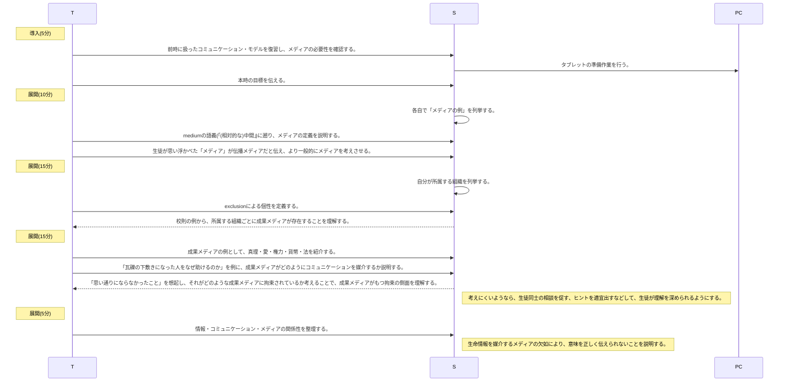
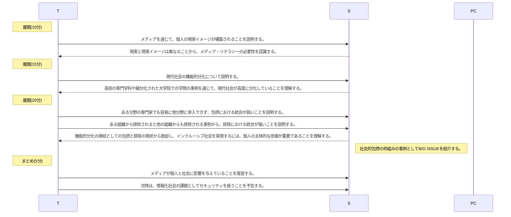

# メディアと機能的分化(2時間)
単元: 社会と情報「コミュニケーション 1.コミュニケーション」(p.28-29)

## 本時の位置づけ
メディアは、コミュニケーションにおいて情報が伝達されるのを仲介している。
そのため、情報、コミュニケーションと並んでメディアを理解することで、現代社会を秩序付けるメカニズムを俯瞰できる。
また、コミュニケーションから構成される社会システムでは、メディアの存在により機能的分化が促進される。
機能的分化は現代社会に特徴的な性質であり、次時以降で扱う知的財産や情報安全、ユニバーサルデザインを理解する基礎ともなる。
## 教材観
メディア(media)は「中間の」を意味するmediumの複数形で、「間に入るもの」を原義とする。
現代の人間生活では、インターネット、放送などの伝播メディアは必要不可欠なものとして遍在しており、コミュニケーションにおいて機械情報を物理的に媒介している。
また、法や貨幣、権力、愛、真理などの成果メディアは社会情報を論理的に媒介し、人間社会における共通理解の形成に寄与しているが、存在を意識する機会は少ない。
機能的分化については、exclusionによる個性の定義と、包摂と排除の問題を扱うことで、現代社会へ主体的に参画することの重要さを伝えることができる。
## 生徒観
生徒はスマートフォンやタブレットPCを用い、さまざまな伝播メディアに日々接しており、現実イメージの形成においてメディアから多大な影響を受けている。
ただ、メディアとして伝播メディアを想像する生徒が大半であり、成果メディアによる社会秩序への寄与についての認識は不十分である。
また、西京高校の生徒は1年生で公民科を履修しないことにも配慮を要する。
## 指導観
以上より本時では、特に成果メディアについて、どういう意味合いで人間のコミュニケーションを媒介するのか、具体例を考えながら理解させる。
導入では、生徒が「メディア = 伝播メディア」のイメージを持っていると成果メディアを理解しにくいので、メディアの原義に戻り、その理解を徹底させる。
その上で、現代社会の機能的分化をメディアと関連させて説明することで、メディアが個人や社会に及ぼす影響を理解させる。
同時に、「炎上」や社会的排除、スラムなどの社会問題を扱い、インクルーシブ社会への参画について考える機会とする。
## 本時の目標
<ul>
- コミュニケーションを媒介するメディアの役割を理解し、各メディアがどのようにコミュニケーションに影響するかを具体例で説明できる。
- メディアは個人には現実イメージを与え、社会には機能的分化を促進させることを理解する。
- 現代の機能的分化社会の特徴と問題点を理解し、望ましい社会の在り方や、そのための主体的な関わり方を考察する。

## 指導計画
### 1時限目

### 2時限目

