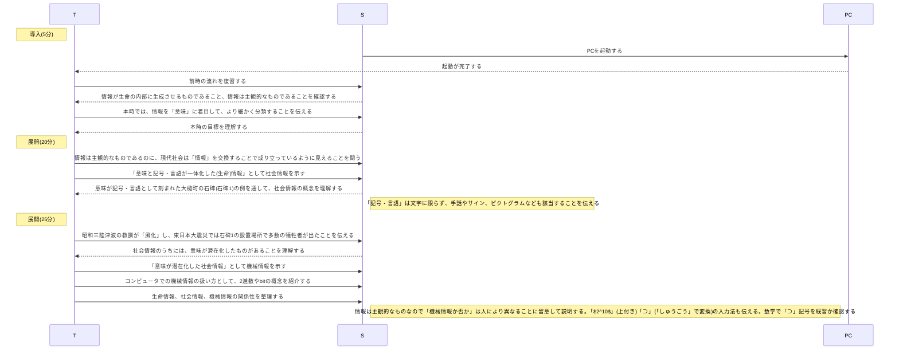
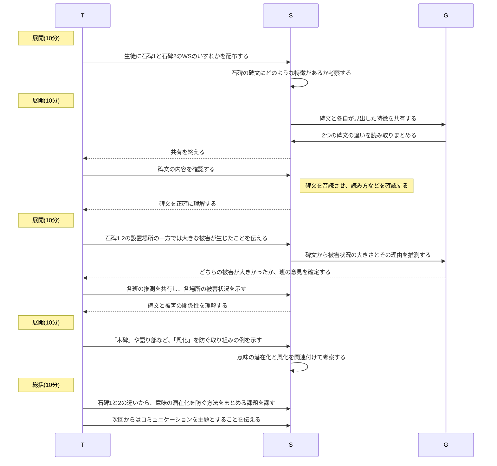

# 社会情報と機械情報(2時間)
単元: 社会と情報「情報社会 1.情報と情報社会」(p.6-7)

## 本時の位置づけ
現代流布している情報に対する誤解の一つは、情報を「もの」のように丸ごと渡したり、やりとりしたりできるというものである。
生命への意味作用として情報を捉えればこれは誤解だが、現代社会はこのような機械的な情報のやりとりなしには成立しない。
本時は、前時で扱った情報のうち、社会でやりとりされる情報として「社会情報」と「機械情報」の概念を導入し、現代社会で情報がやりとりされる仕組みを理解させる。

## 教材観
本時で扱う「社会情報」は、意味と記号・言語が一体化したものとして定義される。
特に、社会情報における意味が潜在化したものとして「機械情報」が定義される。
人間が構成素となる社会システムの内部では、人間同士が社会情報として記号・言語をやりとりしている。
この記号・言語自体は意味が潜在化した機械情報であるが、それをやりとりする人間はその意味を互いに主観的に認識している。
この擬制により、あたかも人から人へ意味が伝達されたかのようにみなされ、システムの変容が進んでいく。
従って、社会情報や機械情報は人間の社会システムを維持するために必須の要素である。
また、これらの違いを説明し、意図を伝える際に機械情報を「もの」のように伝えるだけでは不十分だと理解させる。

## 生徒観
生徒は入学後しばらく経過し、概ね学校生活を楽しんでいるものの、対人関係に課題を抱える生徒もいる。
また、学校の内外で級友との交流が増えるにつれ、言葉や文字でのメッセージのやりとりでトラブルが生じることもある。
こうした問題が生じる原因の一つは、相手に意図を伝える際に、一方的な伝達で十分だと錯覚してしたり、用いた機械情報の解釈が主観的になされることを十分理解していないことだと考えられる。

## 指導観
以上より本時では、社会情報を基盤に現代社会が成立していることを伝えると同時に、流布している情報は機械情報であり、その解釈には多分に主観の入る余地があることを認識させる。
その際、機械情報の解釈が変容する例として風化を取り上げ、時代が下るにつれ、被災を伝える石碑がその周囲の人々にとって軽視されるようになった歴史を学ぶ。
風化を防ぐ方法を考察することを通じ、被災体験を社会情報として伝承することの難しさを理解させる。
また、風化を防ぐため実際に活用されている事例として、繰り返し津波が襲う東北での「木碑」などを紹介する。

## 本時の目標
- 機械情報と社会情報の間に、意味が潜在化しているか否かの違いがあることと、その違いが主観に起因することを理解する。
- 意味の潜在化が生じる原因を批判的に考察し、風化を防ぐ方法を検討できるようになる。

## 指導計画
### 1時限目

### 2時限目

