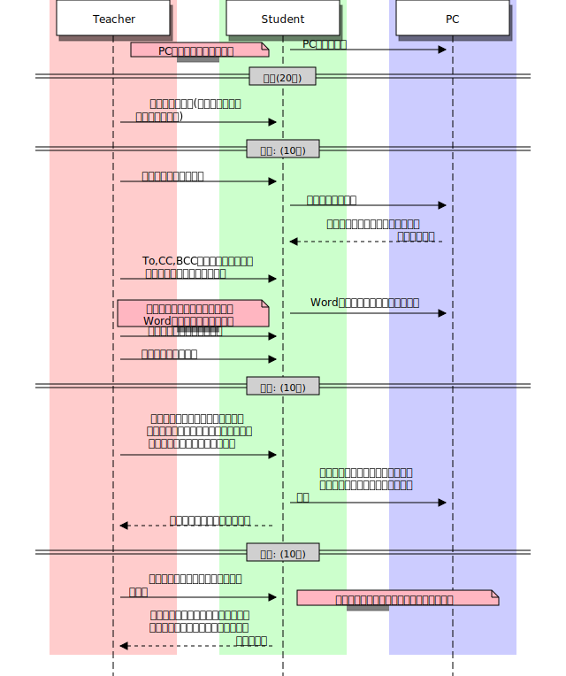

# 情報とは(2時間)
単元: 社会と情報「情報社会 1.情報と情報社会」(p.6-7)

## 本時の位置づけ
現代の社会が「情報化社会」と呼ばれるなど、「情報」は社会において重要な役割を果たしている。
しかし「情報」とはそもそも何であるのかという根本的な問題がおざなりにされているため、曖昧なまま「情報」の言葉だけが人口に膾炙し、真に情報を理解している人間は数少ない。
「情報」を中心に扱う「社会と情報」の最初の単元となる本時では、これ以後の授業で扱う「情報」を定義すると共に、その基本的な性質について認識させる。

## 教材観
本時では「情報とは何か」を考えるにあたり、まず現代社会を表す用語として「情報化社会」を取り上げ、私達が日々「情報」なるものに囲まれて生活していることを確認する。
次に、協同学習を行う、辞書の「情報」の頁を使うなどして語義の曖昧さを確認する。
日本語における「情報」の語源を紹介して、「情報」がそもそも外来語で、英語のinformationに遡る必要があることを認識させる。
その動詞形であるinform(知らせる)はin-form(内部に形成する)の意であり、情報が「生命の内部で主観的に形成されたもの」であることを示す。

## 生徒観
生徒は西京高校に入学してすぐの段階であり、中学で学んだ技術科の延長として情報科を認識している。
そのため、情報科はPCの操作やプログラミングなどの技能を学ぶ科目だという認識が強い。
技術の授業の内容は中学ごとに大きく異なるため、個々のITリテラシーの差は大きく、キーボードのタイプに難儀する生徒もいれば、個人でプログラミングを行った経験のある生徒もいる。

## 指導観
以上より本時では、情報科の目的である「情報に関する科学的な見方や考え方を養う」ことや「社会の情報化の進展に主体的に対応できる能力と態度を育てる」ことに即し、情報に対する正しい理解を与えることを目的とする。
その際、「情報」なるものの認識が個々で大きく異なることを確認するため、「情報」と呼ばれるものを列挙するbrainstormingを行う。
また、特に年度初めの授業であるため、タブレットPCを用いた生徒のノートテイキングの状況を注意深く観察し、ITリテラシーの低い生徒にも配慮すると共に、タブレットPCにトラブルが生じていないかについても観察する。

## 本時の目標
- 現代は「情報化社会」と呼ばれているが、情報の語義が曖昧なままに使われており、個々人で認識が大きく異なることを理解する。
- 情報は生命の内部で形成されるものであることを認識し、その形成には主観が大きく関わることを理解する。

## 指導計画

