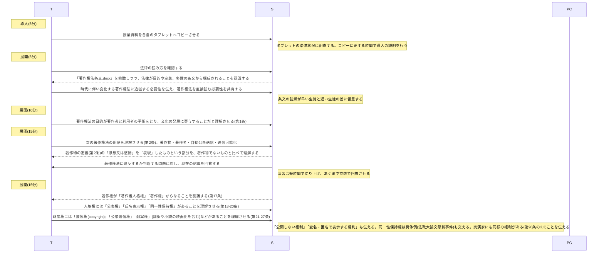
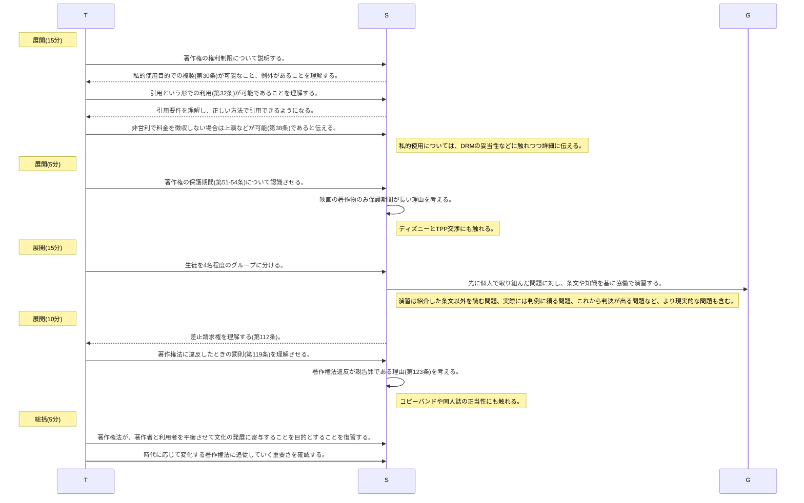

# 著作権(2時間)
単元: 社会と情報「情報安全 7.著作権 8.著作物の利用」(p.74-79)

## 本時の位置づけ

## 教材観
著作権法は特許法と並ぶ知的財産法の中心となる法律であり、生徒が社会生活を送る上で最も身近な法律の一つである。
著作者と著作物の利用者の間のtrade-off関係の平衡点としての著作権法は、時代の変化に対して鋭敏に改正を重ねて複雑化し、生徒も敬遠しがちである。
しかしその条文には先人の努力の跡を垣間見ることができ、人類の叡智の極致ともいえる血の通った法律である。
社会の変化に即応して改正を続ける著作権法の意義を適切に理解することで、現代を生き抜く上での学び続けることの必要性を生徒に認識させることができる。
従って著作権法は、情報化社会・法治社会の底流を理解する点で最適な教材である。

## 生徒観
西京高校の1年生は全体的にコミュニケーション能力が高く、他校と比べても学力的に秀でているといえる。
また、協働学習に対して主体的・積極的に取り組む姿勢も多くの生徒で見られる。
著作権や知的財産に関しては、中学校での授業の実施度合い・定着度合いに生徒間で大きな差があるため、著作権を中学校で学んだ生徒も、今回初めて学ぶ生徒もいる。
著作権に関わる問題は身近だが複雑なものがあるため、これを課題を協働学習の課題とすることで、いずれの生徒も意欲的に取り組めると考えられる。

## 本時の目標
- 著作者の権利の保護と著作物の公正な利用の間の対立関係を理解し、著作権とその利用に対する正しい認識を持つ。
- 時代と共に著作権の範囲や知財関係の法律が変化することを理解し、最新の法律を主体的に学ぶ重要性を認識する。

## 指導計画
### 1時限目

### 2時限目

