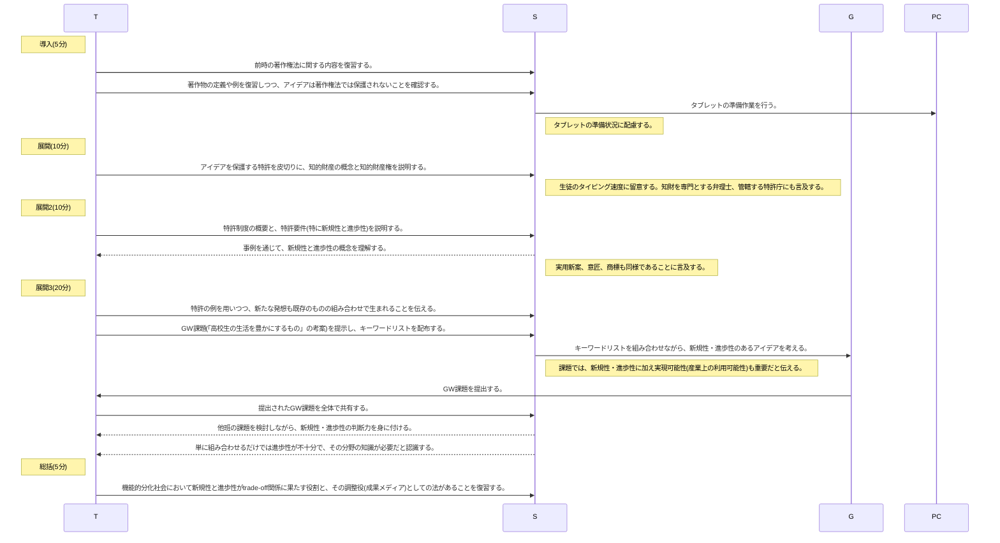

# その他の知的財産(1時間)
単元: 社会と情報「情報安全 6.知的財産権の概要と産業財産権」(p.72-73)

## 本時の位置づけ

## 教材観
知的財産法は成果メディアの一つであり、権利者と利用者の間のtrade-off関係を平衡している。
前時で扱った著作権と知財の双璧をなし、産業財産権の代表でもある特許制度については、発明者に大きな権利が与えられることから、特許として認められるためのハードルが極めて高くなっている。
特に、特許要件のうち重要な位置を占める新規性と進歩性の概念は、生徒が日常生活の中でtrade-off関係を批判的に思考する上でも優れた示唆を与える。
従って、知財の概要を紹介するだけでなく、新規性と進歩性を学ぶことを通じて成果メディアとしての法について、生徒の認識を深められる授業を行いたい。

## 生徒観
西京高校の1年生は全体的にコミュニケーション能力が高く、他校と比べても学力的に秀でているといえる。
文化祭で演じる劇やフィールドワークの事前学習に積極的に取り組む他、美術や音楽などへの素養の深さも随所に伺える。
京都という土地柄もあり、生徒はこうした文化的活動に関わる機会も多いため、新規性と進歩性を考える活動は、身近なものとして主体的に取り組むと考えられる。

## 本時の目標
- 優れたアイデアの条件である新規性と進歩性の概念を理解し、生徒個々の創造活動に対する認識を深化させること。
- 日本の知的財産制度の概要を理解し、権利者と利用者の間のtrade-off関係と、それを調整する役目を持つ知財法の成果メディアとしての側面を理解すること。

## 指導計画
### 1時限目

