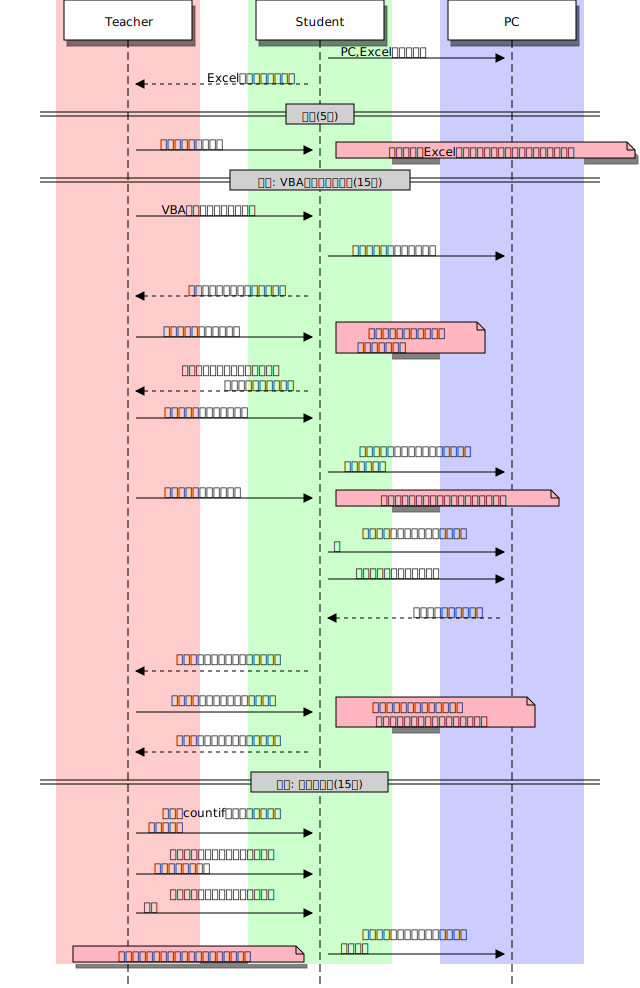
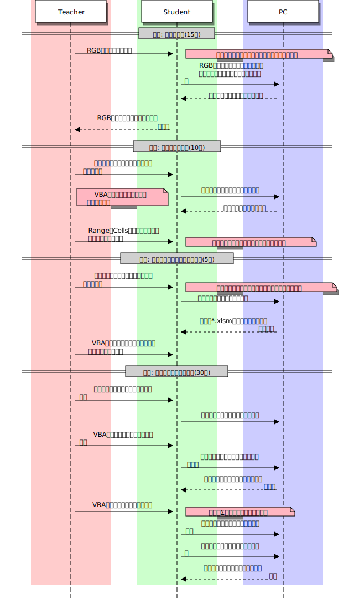
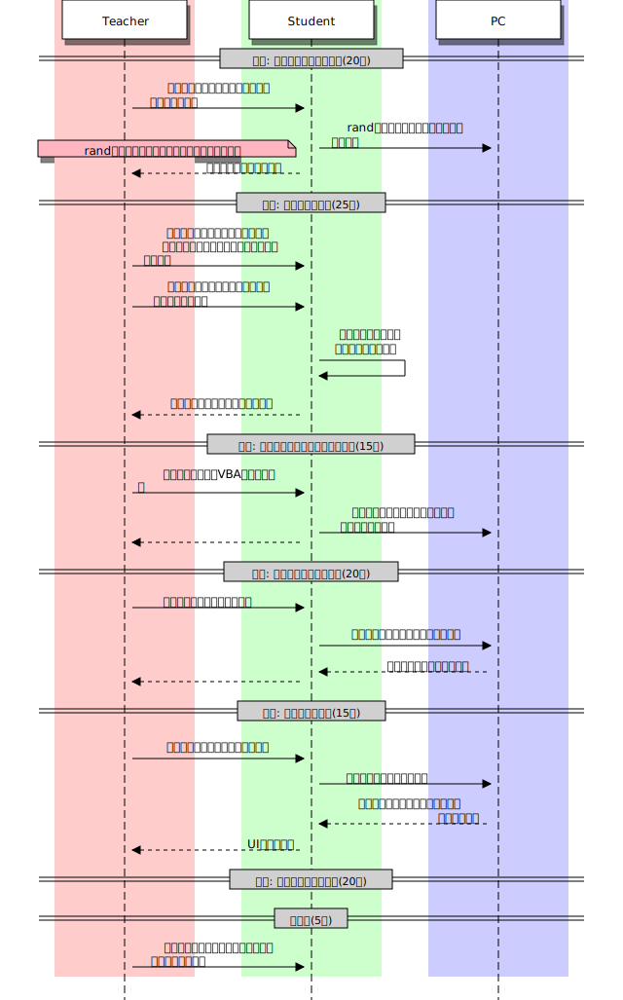

# マクロによる自動化(2時間)
単元: 社会と情報「問題解決 5.関数と統計」(p.126-129)

## 本時の位置づけ
本時は、コンピュータでのより高度な自動化手法として、VBAでのプログラミングを学ぶ。
Excel関数のような手軽な計算だけでなく、命令を組み合わせたプログラミングにより、より高度な自動化を実現できる。

## 教材観
VBAはOffice上で動作し、基本的なプログラミングからGUIでのフォーム作成まで、プログラミングの主要な面を学ぶことができる環境である。
また、Officeの操作を自動化できる点はVBAの大きな利点であり、プログラミングを専門としない生徒にも実用的である。

## 生徒観
西京高校の生徒は、各教科の授業や課題でExcelなどのOfficeを使う機会が多い。
また、将来的に行うであろう商務や研究の場面でも、これらのソフトウェアを利用すると考えられる。
VBAを用いた自動化によりこれらの単純作業を効率化でき、より本質的で創造的な作業に従事できるようになる。

## 指導観
以上より本時では、VBAでのプログラミングを通して、生徒が日々行う日常的な処理を自動化することを学ぶ。
その際、生徒がVBAの文法や関数に習熟していないことを考慮し、最初は記録したマクロの理解からはじめ、徐々に命令や制御構造を記述していく。

## 本時の目標
- マクロによる逐次処理の記録について理解する。
- 逐次・選択・反復を組み合わせたプログラミングを行える。

## 指導計画

