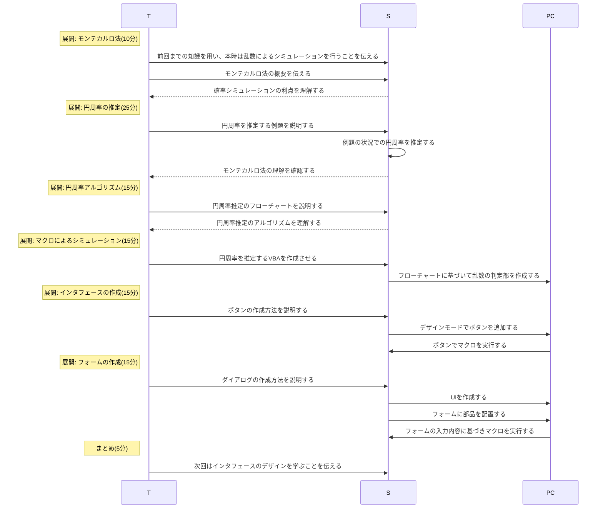
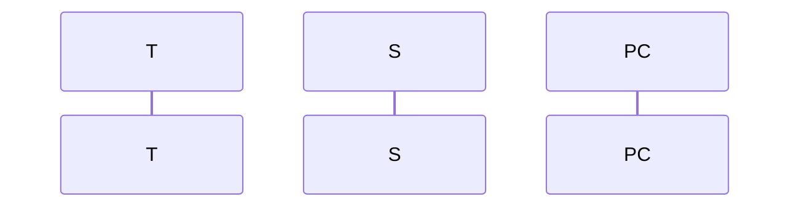

# シミュレーション(2時間)
単元: 社会と情報「問題解決 4.分析のための工夫, 5.関数と統計」(p.122-129)

## 本時の位置づけ

## 教材観

## 生徒観

## 指導観

## 本時の目標
- 
- 

## 指導計画
### 1時限目

```mermaid
sequenceDiagram
	participant T
	participant S
	participant PC

Note left of T: 展開: モンテカルロ法(10分)
	T->>S: 前回までの知識を用い、本時は乱数によるシミュレーションを行うことを伝える
	T->>S: モンテカルロ法の概要を伝える
	S-->>T: 確率シミュレーションの利点を理解する

Note left of T: 展開: 円周率の推定(25分)
	T->>S: 円周率を推定する例題を説明する
	S->>S: 例題の状況での円周率を推定する
	S-->>T: モンテカルロ法の理解を確認する

Note left of T: 展開: 円周率アルゴリズム(15分)
	T->>S: 円周率推定のフローチャートを説明する
	S-->>T: 円周率推定のアルゴリズムを理解する

Note left of T: 展開: マクロによるシミュレーション(15分)
	T->>S: 円周率を推定するVBAを作成させる
	S->>PC: フローチャートに基づいて乱数の判定部を作成する

Note left of T: 展開: インタフェースの作成(15分)
	T->>S: ボタンの作成方法を説明する
	S->>PC: デザインモードでボタンを追加する
	PC->>S: ボタンでマクロを実行する

Note left of T: 展開: フォームの作成(15分)
	T->>S: ダイアログの作成方法を説明する
	S->>PC: UIを作成する
	S->>PC: フォームに部品を配置する
	PC->>S: フォームの入力内容に基づきマクロを実行する

Note left of T: まとめ(5分)
	T->>S: 次回はインタフェースのデザインを学ぶことを伝える
```

### 2時限目

```mermaid
sequenceDiagram
	participant T
	participant S
	participant PC

```
