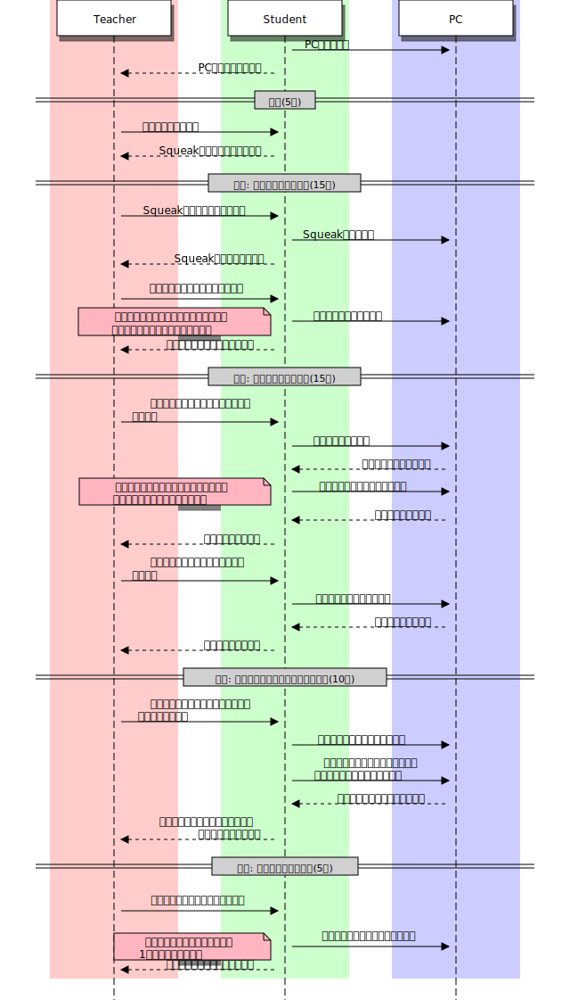
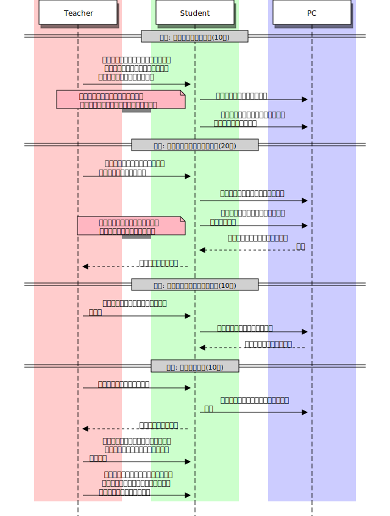
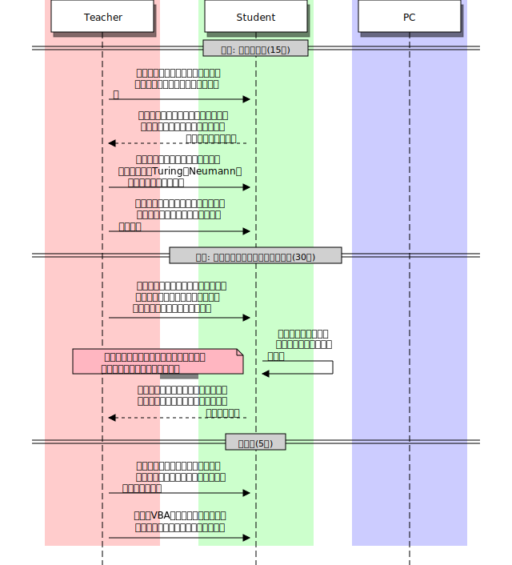

<?xml version="1.0" encoding="utf-8"?>
<?xml-stylesheet type="text/xsl" href="../../plan.xsl"?>
<log title="情報科学習指導案" by="大西 洋(京都市立西京高校)" plan="1" embed="1">
<article>
<ol>
	<li>日時: 11月中旬</li>
	<li>単元: 社会と情報「問題解決 4.分析のための工夫」(p.122-125)</li>
	<li>教科書: 実教出版『高校 社会と情報』</li>
	<li>単元の目標 
		情報機器や情報通信ネットワークなどを適切に活用して問題を解決する方法を習得させる。</li>
	<li>単元の指導計画 
		$§.$ プログラミング
		<cmd name="vspace"><parm>-1.5em</parm></cmd>
		<multicols num="2">
		1. プログラミングの概要(3時間, 本時) 
		2. 分析のための工夫(1時間) 
		3. 関数と統計(2時間) 
		4. マクロによる自動化(2時間) 
		5. シミュレーション(2時間) 
		6. Scratchでのプログラミング(4時間)
		</multicols>
		<cmd name="vspace"><parm>-1.5em</parm></cmd></li>
	<li>本時の位置づけ 
		プログラミングはコンピュータを能動的に活用し、個人の活動を効率化するための手段として特に有用である。
		また、限られた文法の範囲内で正しく命令を組み合わせるプログラミングを通して、生徒の論理的思考力や情報伝達能力の涵養が期待される。
		<!-- TODO: プログラミングの目的を整理 -->
		</li>
	<li>教材観 
		コンピュータを用いて処理を行う最も基本的な利点は、プログラムの記述による自動化である。
		命令を書き並べたプログラムを事前に用意してコンピュータに読み込ませることで、人間が一つ一つ機械に命令せずとも、所望の処理が実現される。
		自動化の利点を享受するためには、コンピュータの内部動作に対する適切な理解に基づき、逐次・選択・反復を組み合わせてプログラミングを行うことが必要となる。
		</li>
	<li>生徒観 
		西京高校の生徒は、課題への取り組みや他の生徒とのコミュニケーションなど、スマートフォンやタブレットPCなどのコンピュータを利用する機会が多い。
		一方で、コンピュータの動作に関する理解が不十分で混乱したり、コンピュータの能力を十分に活用できていなかったりする生徒も一部にみられる。
		そのため、コンピュータを用いる利点や、コンピュータの基本的な内部動作を理解することが必要である。</li>
	<li>指導観 
		以上より本時では、座学でコンピュータの内部動作を理解させつつ、自動化の便利さを体感できる実習を行う。
		座学では、Neumann式コンピュータの発明に寄与したTuringとNeumannの業績を紹介すると共に、Dijkstraの構造化プログラミングに基づいてアルゴリズムの概念を示す。
		また実習では、コンピュータに不慣れな生徒でも自動化の恩恵を実感できるよう、初心者でも簡単に扱えるビジュアルプログラミング環境のSqueak eToysを用いる。
		オブジェクト指向プログラミングのメッセージ交換と、逐次・選択・反復の組み合わせを理解できる例として、簡単な自動運転プログラムを作成する。</li>
	<li>本時の目標
		<ul>
			<li>コンピュータの特徴と自動化の利点を理解し、処理を適切に自動化できる。</li>
			<li>逐次・選択・反復を組み合わせて、機械や他者が実行できる形で手順を表現できる。</li>
		</ul></li>
	<li>指導計画
		
		
		</li>
</ol>
</article>
</log>
