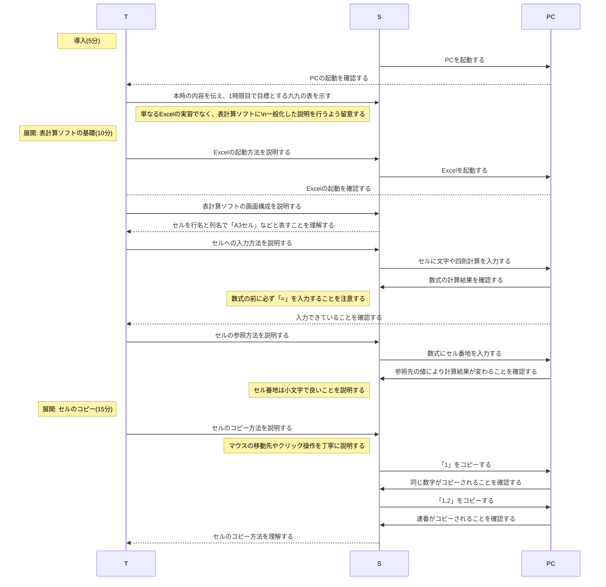
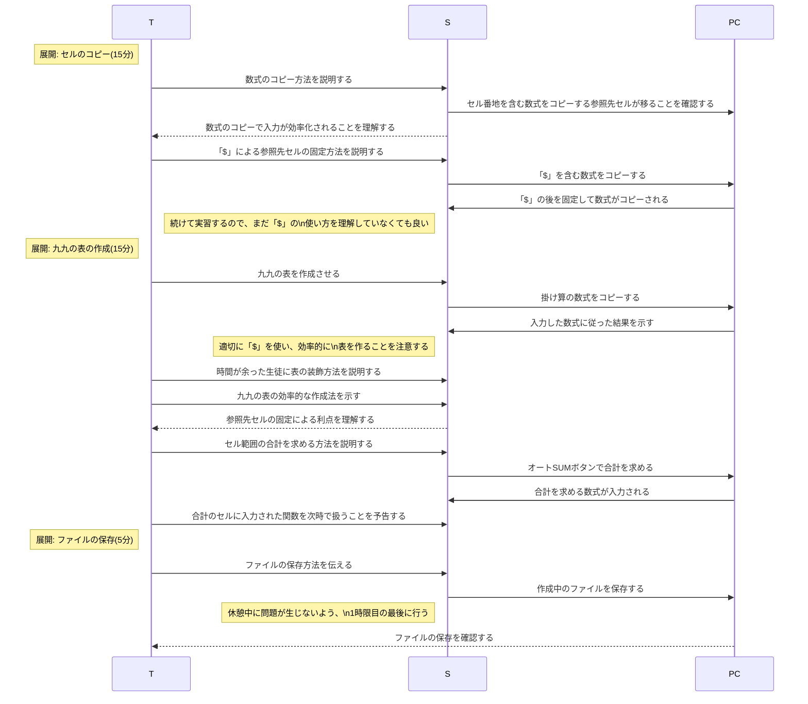
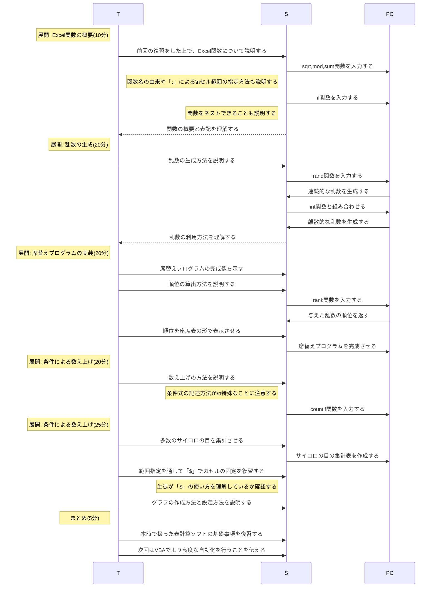

# 分析のための工夫,関数と統計(3時間)
単元: 社会と情報「問題解決 4.分析のための工夫, 5.関数と統計」(p.122-129)

## 本時の位置づけ
本時で扱う表計算ソフトは、それ自体が統計の重要なツールであるだけでなく、高度なシミュレーションや自動処理のための基本環境でもある。
問題解決の実践的な手順として、表計算ソフトを活用してデータを効率的に処理し、適切に分析することが必要である。

## 教材観
表計算ソフトは、セルに値を入れて記録できるだけでなく、数式をデータの内部に組み込んで自動計算できる。
表やグラフを作成するだけでなく、数式や関数を適切に用いることで、コンピュータを用いたデータ処理を効率化できる。

## 生徒観
西京高校の生徒は、各教科の授業や課題で表計算ソフトを使うほか、グラフや表を用いたプレゼンテーションの機会も多い。
しかし、それらの場面での表計算ソフトの利用は基本的な入力機能に留まり、表計算ソフトの高度な機能の恩恵を得ることは少ない。
また、中学校で表計算ソフトについて学んだ生徒が少なく、表計算ソフトの独特な操作に苦手意識を持つ生徒もいる。

## 指導観
以上より本時では、実習を通して表計算ソフトの強力な機能の便利さを学べるようにする。
九九の表の作成を通して数式のコピーやセルの絶対参照を学び、席替えプログラムの作成を通して乱数を含むExcel関数の使い方を学ぶ。
特に、テキストでは分かりにくい画面上の動作や、調べにくいが便利な機能を丁寧に指導する。
その際、セルなどの基本的な構成を説明する、マウスやキーボードの操作を画面で示すなどして、表計算ソフトに苦手意識を持つ生徒に配慮する。

## 本時の目標
- 表計算ソフトの基本的な構成と操作を理解する。
- 数式や関数とそのコピーの利便性を理解し、身近な場面で活用できる。

## 指導計画
### 1時限目

### 2時限目

### 3時限目

