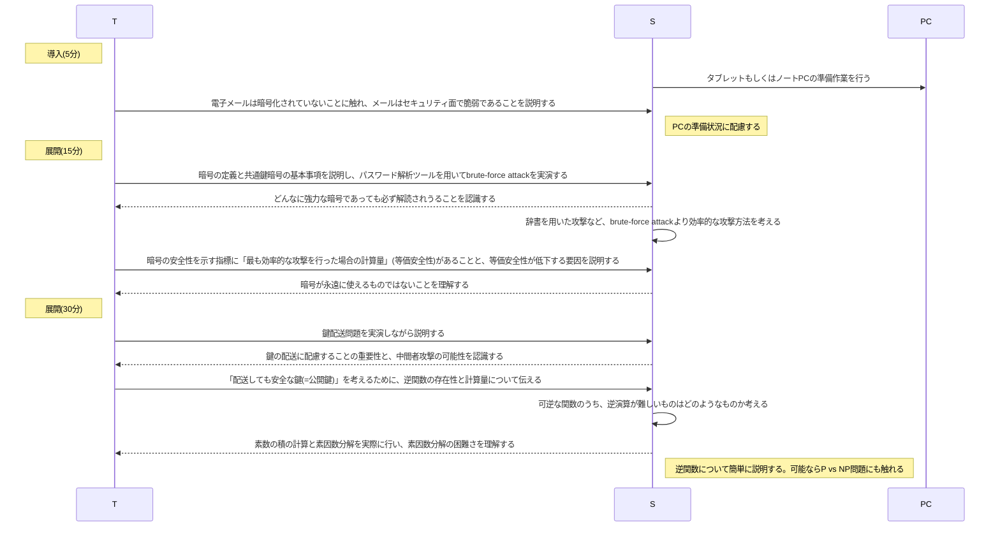
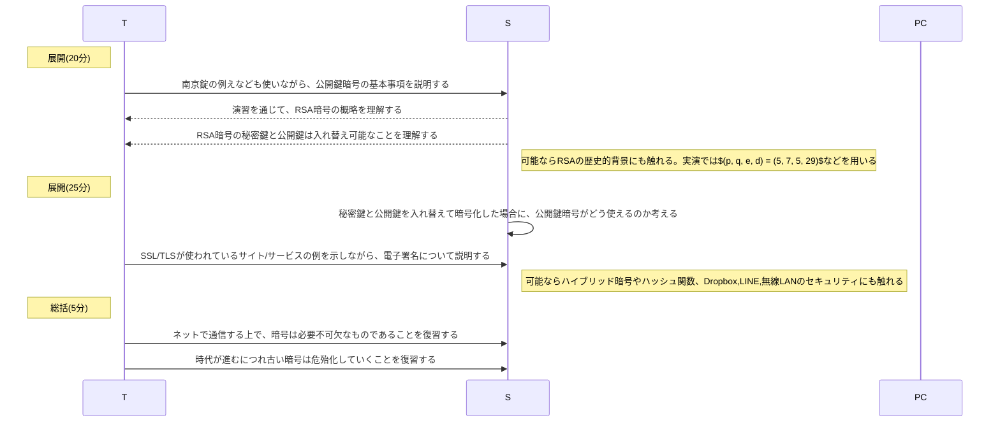

# 安全のための情報技術(2時間)
単元: 社会と情報「情報安全 3.安全のための情報技術 4.暗号化」(p.64-69)

## 本時の位置づけ
eコマースサイトで入力するカード番号や、親しい相手に個人的に送るメッセージなど、公にしたくない情報をやりとりする機会は今後ますます増加していくと考えられる。
こうした情報を送る際には、悪意ある第三者による不正利用を防ぐため、相手までの経路が十分に暗号化されていることが重要となる。
情報セキュリティを支えている暗号技術は、生徒自身に何らかの問題が起こらない限り意識しにくいものであるため、本時の授業を通じて生徒の認識を深めていく。

## 教材観
公開鍵暗号の例として本時で扱うRSA暗号は、現在も広くHTTPS(SSL/TLS)による暗号化通信で一般的に利用されているアルゴリズムである。
数学的に正しさが証明されているアルゴリズムが実社会で利用されているというだけでなく、それが素因数分解という高校生にも分かる易しい数学で実現されている点も重要である。
また、素因数分解の困難さや暗号の安全性に関する計算量的な視点や、誰もが利用している電子署名への応用など、理論面でも実践面でも興味深い教材である。

## 生徒観
西京高校では全生徒がタブレットPCを所持していることもあり、クラウドストレージなどの機密性が要求されるWebサービスを日頃から利用している生徒が多い。
また、殆どの生徒がLINEなどのメッセンジャーアプリを使っているため、暗号化された通信を日々行っている。
しかし、そうしたアプリやサービスでは通常、セキュリティ面について利用者に意識させることはないため、安全性や攻撃リスクに対する生徒の理解は十分とはいえない。

## 指導観
以上より本時では、共通鍵暗号と公開鍵暗号を比較したり、RSA暗号の具体的なアルゴリズムにも踏み込みながら、生徒のセキュリティに対する認識を深めることを目的とする。
その際、作成した教材で暗号化/復号を体験させるだけでなく、実際にHTTPSのWebサイトでRSAが使われていることも生徒に示すことで、社会の中で数学的な手法が利用されていることを伝えていく。

## 本時の目標
- 暗号の安全性が技術の進歩や新たな手法の発見により低下し、常に新しい暗号が必要になることを理解する。
- 共通鍵暗号に内在する鍵配送問題と、その解決策としての公開鍵暗号の必要性を理解する。
- 逆演算の計算量的な困難さが公開鍵暗号の着想となっていることを理解する。
- 暗号が電子署名として一般的な用途に応用され、誰もが日々利用していることを理解する。

## 指導計画
### 1時限目

### 2時限目

