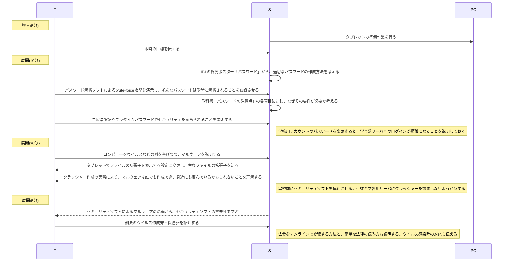
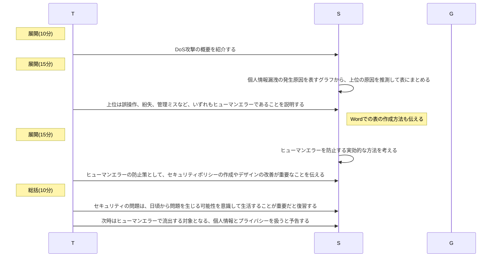
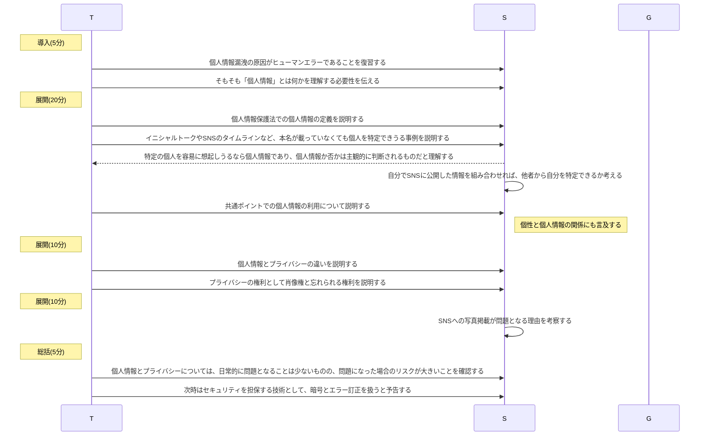

# 個人による安全対策・個人情報(2時間)
単元: 社会と情報「情報安全 1.個人による安全対策」(p.60-62)

## 本時の位置づけ
情報社会では個人の持つ情報に大きな価値があるが、機械情報は簡単に複製できることから、現代では厳重な情報の管理が求められる。
自分のプライバシーを守るため、また他者の個人情報を漏洩してインシデントの当事者にならないため、セキュリティ意識の向上を図る必要がある。

## 教材観
個人で行うセキュリティ対策の基本的なものに、強固なパスワードの使用やウイルス対策ソフトの導入、定期的なバックアップが挙げられる。
これらの重要性は常々言われているが、インシデントが生じない限り、なかなかその重要性を実感する機会はない。
一方で、日頃のちょっとした行為がヒューマンエラーとしてインシデントに繋がるため、安易な行動が問題化しうる。

## 生徒観
生徒はスマートフォンやタブレットPCを日々用いており、校内でもグループ活動などを通じ他の生徒のデータを扱う場面が多くある。
従ってインシデントに遭う可能性も高いが、杜撰なパスワードの管理やデータ消失のトラブル、個人情報の漏洩事案がみられるなど、セキュリティ意識が低い生徒も多い。

## 指導観
以上より本時では、実習や演示、資料を多用してセキュリティ意識の向上を図る。
パスワード解析ソフトを演示することで、脆弱なパスワードは容易に解析されることを認識させる。
また、高校生でも容易にクラッシャーを作成できることを実習させ、危険が身近に潜んでいることを理解させる。
その際、ウイルスの作成・保管・使用が刑法の不正指令電磁的記録に関する罪にあたることも説明し、生徒に本時の知識を悪用させないよう留意する。
更に、ヒューマンエラーがインシデントの原因として大きな割合を占めることを示す、個人情報の主観性・重要性を理解させるなどして、日頃から注意深く情報を扱う必要性を認識させる。

## 本時の目標
- 単純なパスワードによる認証は脆弱で、強固なパスワード・認証方式を使う重要性を理解する。
- クラッシャーの作成やDoS攻撃は誰でも行えるため、身近にも危険がありうることを理解する。
- コンピュータウイルスへの感染やヒューマンエラーは日常的に起こりうることを認識し、常にインシデントの可能性を考慮する。
- 個人情報が他者の主観的な想起により定義されることを理解し、個人を直接示すものでなくても、他者の情報を注意深く扱うべきことを理解する。

## 指導計画
### 1時限目

### 2時限目

### 3時限目

